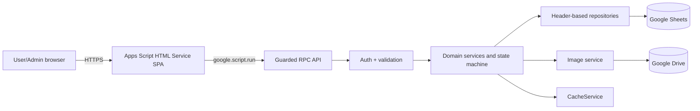

# System Architecture

## Goals

ระบบเป็น internal web application สำหรับองค์กรขนาดเล็กถึงกลาง รองรับประมาณ 1,000–5,000 physical assets โดยใช้ Google Workspace ที่มีอยู่แล้ว ลดภาระการติดตั้งและดูแลโครงสร้างพื้นฐาน และรักษา workflow ให้ย้ายฐานข้อมูลในอนาคตได้

## Context and layers

### Client

`index.html` เป็น shell เดียวและ include เฉพาะ partial ใน allowlist ตอน render เพื่อหลีกเลี่ยงข้อจำกัดหลายหน้าของ Apps Script หน้าเว็บแยก view templates ออกจาก controllers, จัด route ด้วย `google.script.history`/`google.script.url`, และใช้ view token ป้องกัน response เก่าเขียนทับหน้าใหม่

ทุก server call ผ่าน Promise wrapper ของ `google.script.run` และแปล envelope/error เป็น client error แบบเดียว ส่วน mutation สร้าง command ID ก่อนส่งและเก็บใน `sessionStorage` พร้อม fingerprint ของ payload เพื่อให้ retry หลังผลลัพธ์ไม่แน่ชัดใช้คำสั่งเดิมเท่านั้น ทุก action มี loading, success/error ภาษาไทย, field feedback และ confirmation ตามความเสี่ยง

### API and authorization

API เปิดเฉพาะ use-case ที่ชัดเจน เช่น `listEquipment`, `createBorrowRequest`, `adminApproveBorrow` และ `adminCompleteReturn` ไม่เปิด generic Sheet CRUD ทุก public wrapper resolve ผู้ใช้จาก session, ตรวจสถานะ user และตรวจ role ฝั่ง server ก่อนทำงาน

### Domain services

บริการ Equipment, Borrow, User, Category, Dashboard, Image และ History เป็นเจ้าของ business rules โดยเฉพาะ BorrowService เป็นผู้เดียวที่เปลี่ยนสถานะ workflow ของ Equipment ระหว่าง Pending/Reserved/Borrowed/Returning ส่วน OperationService เป็น durable coordinator สำหรับ idempotency และ recovery ของ mutation ข้ามหลายชีต/Google Drive โดยไม่อ้างว่า Sheets มี transaction

### Repositories

repository อ่าน header และ `getValues()` ครั้งเดียวต่อชุดข้อมูล แปลง row เป็น plain object และ batch write กลับด้วย `setValues()` จึงไม่ผูก domain logic กับเลขแถวหรือ Spreadsheet API โดยตรง

## Mutation protocol

ทุก mutation สำคัญใช้ลำดับเดียวกัน:

1. ตรวจรูปแบบ payload ที่ไม่ต้องอ่านฐานข้อมูล
2. ขอ Script Lock พร้อม timeout
3. resolve actor และ role ใหม่ภายใน lock
4. อ่านข้อมูลจริงจาก Sheet โดยไม่ใช้ cache และสร้าง operation specification จาก action, entity/asset, actor และ hash ของ normalized payload
5. ถ้า operation เดิมเป็น `COMPLETED` และ specification ตรงกัน ให้ verify result hash แล้วคืน stored result โดยไม่ทำ domain mutation ซ้ำ
6. ถ้าเป็นคำสั่งใหม่ ให้ตรวจ source state, row version, foreign key และห้ามมี `STARTED` operation อื่นที่ชน entity, asset หรือ normalized unique reservation ก่อนเขียน Operations row สถานะ `STARTED` พร้อม payload/hash และ before-state
7. จัดสรร ID/ผูก entity หรือ external resource เมื่อจำเป็น แล้วเขียนหรือเติมเฉพาะ domain rows ที่ยังอยู่ source state; ถ้าแถวอยู่ exact target state แล้วให้ถือว่า step นั้นสำเร็จจากรอบก่อน
8. รับรองว่ามี History ตรงกับ `operation_id` เพียงหนึ่งแถว จากนั้น bump cache epoch และ `SpreadsheetApp.flush()` เพื่อยืนยัน domain rows กับ audit ก่อน finalize
9. serialize result กับ result hash ลง Operations, เปลี่ยนสถานะเป็น `COMPLETED`, flush อีกครั้งเมื่อออกจาก critical section แล้วปล่อย lock ใน `finally`

Google Sheets ไม่มี rollback/cross-sheet transaction จริง ลำดับ `STARTED → domain rows → exactly-one History → flush → result/COMPLETED` จึงทำให้ความคืบหน้าทนต่อ execution ที่หยุดกลางทาง โดย Borrow ยังเป็นหลักฐาน active workflow และ Equipment เป็น projection สำหรับงานปฏิบัติการ

### Retry and reconciliation

- Retry ต้องใช้ command ID, action และ normalized payload เดิม; action/entity/asset/hash ที่ไม่ตรงจะถูกปฏิเสธด้วย conflict และ actor ต้องเป็นเจ้าของเดิม เว้นแต่ admin ทำ controlled reconciliation
- `COMPLETED` verify hash แล้วคืน stored result เดิม ส่วน `STARTED` verify payload hash, โหลด payload/before-state เดิม และทำต่อเฉพาะ step ที่ขาด
- การ resume ยอมรับ domain row เฉพาะ exact source หรือ exact target state/row version ที่ operation บันทึกไว้ ถ้ามีการแก้ไขต่อจากนั้นจะ fail closed แทนการเดาผลลัพธ์
- `STARTED` ของ entity หรือ asset เดียวกันบล็อก command ID อื่นด้วย `OPERATION_PENDING`; asset guard ครอบคลุมคำขอยืมที่ยังไม่มี Borrow ID และ workflow ที่แตะ Equipment เดียวกัน
- `STARTED` ยังจอง normalized serial number, user email และ category name สำหรับ create/edit ที่เกี่ยวข้อง ปิดช่องให้ command คนละ entity ผ่าน uniqueness preflight พร้อมกันแล้วมาชนกันภายหลัง
- Image operation เก็บ `resource_id` เพื่อไม่สร้างไฟล์ซ้ำและให้ cleanup เฉพาะไฟล์ใหม่ที่ operation นั้นสร้าง
- ถ้า image upload หยุดก่อนเปลี่ยน Equipment และไม่สามารถ resume ได้ Admin ยกเลิกแบบมีเหตุผลได้; ระบบพิสูจน์ exact before-state, ห้ามมี History, ย้าย partial Drive file ที่เข้าถึงได้ไป Trash แล้วบันทึกผล hash พร้อมสถานะ `ABORTED` หากโฟลเดอร์เดิมเข้าไม่ได้จะระบุ orphan-cleanup warning ไว้ในผลลัพธ์
- Integrity audit รายงาน journal ที่ค้างและความไม่สอดคล้อง ผู้ดูแลควร replay คำสั่งเดิมเพื่อ reconcile; กรณี state ไม่ใช่ source/target ที่คาดไว้ต้องใช้การซ่อมแบบตรวจสอบได้ ไม่แก้ Operations/History โดยตรง

## Performance

- Equipment search/filter/sort/pagination ทำบน server และจำกัด page size สูงสุด 100
- อ่านแต่ละ Sheet เป็น block ไม่อ่านทีละ cell
- reference lists และ dashboard อาจ cache ระยะสั้นโดยมี cache epoch หลัง mutation
- availability, role, counter และ active borrow ไม่ใช้ cache ตัดสินความถูกต้อง
- DTO คืนเฉพาะข้อมูลที่หน้าปัจจุบันต้องใช้ และแปลง Date เป็น string เสมอ

## Security boundaries

- Deployment จำกัด Google Workspace domain เดียวและ unknown user ถูกปฏิเสธเป็นค่าเริ่มต้น
- server ไม่รับ user email, role, audit actor, timestamp หรือ protected status จาก browser เป็นความจริง
- user อ่าน Borrow ของตนเองเท่านั้น; admin อ่านและ mutate ข้อมูลส่วนกลางตาม action ที่อนุญาต
- ข้อมูล text ถูกจำกัดความยาว ป้องกัน formula injection ก่อนลง Sheet และ escape ก่อนเข้า HTML
- QR มีไว้ระบุ Asset ID/route เท่านั้น ไม่ให้สิทธิ์และไม่ trigger mutation อัตโนมัติ
- History ไม่มี update/delete endpoint และ reference records ใช้ inactive/retired แทน delete
- Operations และ payload/before/result evidence ไม่มี generic browser endpoint; client ได้รับเฉพาะผลลัพธ์ use-case ที่ผ่าน authorization
- รูปใน Drive รองรับเฉพาะ `DOMAIN_WITH_LINK` หรือ `ANYONE_WITH_LINK`, ตรวจ effective sharing หลังตั้งค่า และเก็บ resource key ใน URL เมื่อ Drive กำหนด; ไม่มีโหมด `PRIVATE` ที่อ้างว่า browser ของผู้ใช้คนอื่นเปิดรูปได้โดยไม่มี delivery proxy

## Deployment topology

โปรเจกต์ Apps Script แบบ standalone เชื่อม Google Sheet ด้วย ID และ Drive folder ด้วย ID จาก Script Properties deploy เป็น Web app การใช้ deployment เดิมเมื่อลง version ใหม่ช่วยรักษา `/exec` URL ให้ QR sticker เดิมยังใช้ได้
