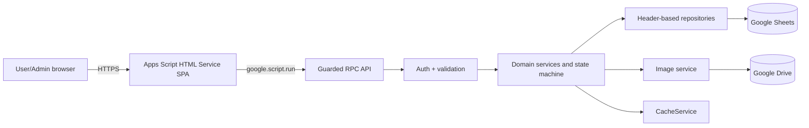

# System Architecture

## Goals

ระบบเป็น internal web application สำหรับองค์กรขนาดเล็กถึงกลาง รองรับประมาณ 1,000–5,000 physical assets โดยใช้ Google Workspace ที่มีอยู่แล้ว ลดภาระการติดตั้งและดูแลโครงสร้างพื้นฐาน และรักษา workflow ให้ย้ายฐานข้อมูลในอนาคตได้

## Context and layers

### Client

`index.html` เป็น shell เดียวและ include partials ตอน render เพื่อหลีกเลี่ยงข้อจำกัดหลายหน้าของ Apps Script หน้าเว็บเก็บ state ขนาดเล็ก จัด route ด้วย `google.script.history`/`google.script.url` และเรียก server ผ่าน Promise wrapper ของ `google.script.run` ทุก call มี loading, success, error และ confirmation feedback

### API and authorization

API เปิดเฉพาะ use-case ที่ชัดเจน เช่น `listEquipment`, `createBorrowRequest`, `adminApproveBorrow` และ `adminCompleteReturn` ไม่เปิด generic Sheet CRUD ทุก public wrapper resolve ผู้ใช้จาก session, ตรวจสถานะ user และตรวจ role ฝั่ง server ก่อนทำงาน

### Domain services

บริการ Equipment, Borrow, User, Category, Dashboard, Image และ History เป็นเจ้าของ business rules โดยเฉพาะ BorrowService เป็นผู้เดียวที่เปลี่ยนสถานะ workflow ของ Equipment ระหว่าง Pending/Reserved/Borrowed/Returning

### Repositories

repository อ่าน header และ `getValues()` ครั้งเดียวต่อชุดข้อมูล แปลง row เป็น plain object และ batch write กลับด้วย `setValues()` จึงไม่ผูก domain logic กับเลขแถวหรือ Spreadsheet API โดยตรง

## Mutation protocol

ทุก mutation สำคัญใช้ลำดับเดียวกัน:

1. ตรวจรูปแบบ payload ที่ไม่ต้องอ่านฐานข้อมูล
2. ขอ Script Lock พร้อม timeout
3. resolve actor และ role ใหม่ภายใน lock
4. อ่านข้อมูลจริงจาก Sheet โดยไม่ใช้ cache
5. ตรวจ source state, row version, foreign key และ idempotency key
6. จัดสรร ID จาก Sequences
7. เขียน domain rows แบบ batch
8. append History, bump cache epoch และ `SpreadsheetApp.flush()`
9. ปล่อย lock ใน `finally`

Google Sheets ไม่มี cross-sheet transaction จริง ระบบจึงให้ Borrow เป็นหลักฐาน active workflow, เขียน History ใน critical section และมี integrity audit สำหรับตรวจความไม่สอดคล้อง

## Performance

- Equipment search/filter/sort/pagination ทำบน server และจำกัด page size สูงสุด 100
- อ่านแต่ละ Sheet เป็น block ไม่อ่านทีละ cell
- reference lists และ dashboard อาจ cache ระยะสั้นโดยมี cache epoch หลัง mutation
- availability, role, counter และ active borrow ไม่ใช้ cache ตัดสินความถูกต้อง
- DTO คืนเฉพาะข้อมูลที่หน้าปัจจุบันต้องใช้ และแปลง Date เป็น string เสมอ

## Security boundaries

- Deployment จำกัด Google Workspace domain เดียวและ unknown user ถูกปฏิเสธเป็นค่าเริ่มต้น
- server ไม่รับ user email, role, audit actor, timestamp หรือ protected status จาก browser เป็นความจริง
- user อ่าน Borrow ของตนเองเท่านั้น; admin อ่านและ mutate ข้อมูลส่วนกลางตาม action ที่อนุญาต
- ข้อมูล text ถูกจำกัดความยาว ป้องกัน formula injection ก่อนลง Sheet และ escape ก่อนเข้า HTML
- QR มีไว้ระบุ Asset ID/route เท่านั้น ไม่ให้สิทธิ์และไม่ trigger mutation อัตโนมัติ
- History ไม่มี update/delete endpoint และ reference records ใช้ inactive/retired แทน delete

## Deployment topology

โปรเจกต์ Apps Script แบบ standalone เชื่อม Google Sheet ด้วย ID และ Drive folder ด้วย ID จาก Script Properties deploy เป็น Web app การใช้ deployment เดิมเมื่อลง version ใหม่ช่วยรักษา `/exec` URL ให้ QR sticker เดิมยังใช้ได้

